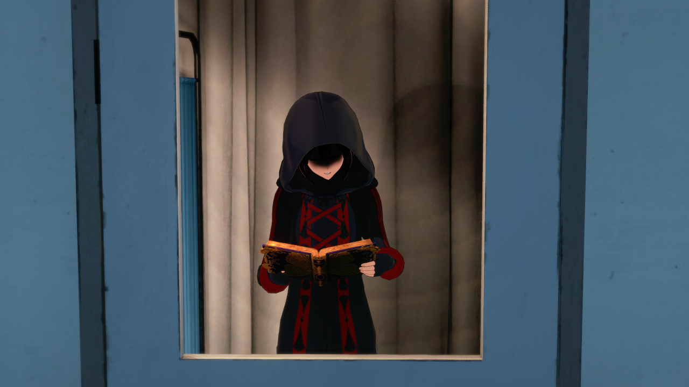

# 🌙 Little Hope (Alpha)

##

* Género: Novela Visual, Drama, Slice of Life, Romance
* Plataformas: PC (Windows, Mac, Linux)
* Motor: Ren'Py 8.1+
* Estado: Alpha 0.01

---

## Descripcion Corta

Tras la marcha de tu padre, te ves forzado/a a empezar de cero en la casa de tu nueva familia. Entre una madrastra demasiado perfecta, una hermanastra que te odia en silencio y una pequeña que es un rayo de luz, tu único objetivo es sobrevivir.
Pero en esta casa nada es lo que parece. Hay secretos ocultos tras las sonrisas y un misterio que late bajo la superficie... uno que te conectará con el destino de una niña.
¿Podrás encontrar tu lugar y, a la vez, desenterrar una verdad que nunca debió ser descubierta?

---

## Sinopsis

Esta historia comienza como muchas otras: con una familia fracturada y la obligación de empezar de nuevo. Al llegar a la casa de tu amorosa madrastra, Emily, y sus dos hijas, te enfrentas a un desafío inmediato. Por un lado, la hostilidad abierta de tu hermanastra Mana, quien parece resentir tu mera existencia. Por otro, la dulce inocencia de la pequeña Ana, que te ve como un nuevo hermano/a mayor.

Tu objetivo inicial es simple: adaptarte. Sin embargo, esta no es una simple historia sobre lazos familiares. Es la antesala de un misterio mucho mayor. Tu llegada a esta casa es el catalizador que comenzará a desvelar la verdad sobre misterios que son desarrollados en secreto por la nueva ciudad, seres creados en circunstancias extraordinarias y cuyas existencias son el secreto mejor guardado de todos. Sumérgete en una narrativa donde tus interacciones diarias y las decisiones que tomes irán pelando las capas de un drama familiar para revelar en su núcleo una historia de ciencia ficción, ética y humanidad.

---

## 📖 Características Principales

* **Historia Ramificada:** Múltiples rutas y finales basados en tus decisiones.
* **Selector de genero:** Los jugadores podran elegir entre hombre y mujer. Tendran diferentes eventos cada uno.
* **Galería de Arte:** Desbloquea CGs (imágenes especiales) a medida que avanzas.
* **Música Original:** Banda sonora compuesta exclusivamente para el juego.
* **Personajes con Voz:** ¡Actuación de voz para los personajes principales! (Pensandolo)

---

## 🎭 Una Historia con Dos Caras
* Al inicio del juego, tomarás la decisión más importante: jugar como un protagonista masculino o femenino.
* Esta elección no es solo un cambio de avatar.
* Desbloquea rutas narrativas, escenas, diálogos y eventos completamente diferentes.
* Vive el Capítulo 1 desde dos perspectivas únicas, cada una con sus propios desafíos y momentos especiales.

---

## 💬 Tus Decisiones Realmente Importan
* Cada elección tiene un impacto tangible en la historia y tus relaciones.
* Sistema de Afecto: Gana o pierde puntos de afecto con Emily, Ana y Mana.
* Tus decisiones determinarán si forjas una amistad sólida, un romance incipiente o una amarga rivalidad.
* Sistema de Banderas (Flags): Pequeñas acciones, como devolver un osito de peluche, se registran y provocan cambios visuales y narrativos más adelante.
* Los personajes recordarán lo que hiciste.

---

## 👥 Personajes

| Personajes | Descripción |
| :--- | :--- |
| **Ana**    | Ana es un rayo de luz y dulzura en la familia. Como la hermana menor, su curiosidad y amabilidad no tienen límites. Con su distintivo pelo azul y una margarita que refleja su espíritu alegre, ella es la primera en ofrecerte una amistad sincera y sin prejuicios. Su inocencia es un soplo de aire fresco que te recordará que no todo está perdido en este nuevo y complicado hogar. |
| **Mana**    | Tu nueva hermanastra y compañera de clase, Mana, es una fortaleza de sarcasmo y hostilidad. Con una inteligencia afilada que usa para mantener las distancias, siempre tiene una respuesta cortante o una mirada de desaprobación. Su estilo impecable y su actitud fría son un escudo para los celos y la inseguridad que se niega a admitir, convirtiéndola en el principal obstáculo en tu nueva vida. |
| **Emily**    | Emily es el cálido corazón de tu nuevo hogar. Con una sonrisa siempre lista y una paciencia infinita, ella es la madrastra que rompe todos los estereotipos. Se esfuerza genuinamente por crear una familia feliz y unida, ofreciendo su apoyo incondicional y, sobre todo, un amor que busca sanar las heridas del pasado. Es el pilar de calma en medio de la tensión familiar.|

---

## 📸 Screenshots

---

## ⌨️ Minijuego de Reflejos
En momentos de alta tensión, la historia se detiene para poner a prueba tus reflejos con un minijuego de teclado.

* Desafío Dinámico: La tecla a pulsar cambia aleatoriamente de fuente, color, tamaño y posición en cada turno, ¡obligándote a estar alerta!
* Consecuencias Reales: El resultado del minijuego (victoria o derrota) tiene un impacto directo en la narrativa. Ganar puede evitar un conflicto, mientras que perder puede traer consecuencias negativas.
* Una Experiencia Inmersiva.
* Hemos cuidado cada detalle para que te sumerjas por completo en el mundo del juego.

---

## 🚀 Estado Actual (Alpha 0.01)
La versión actual incluye:

[x] Flujo de creación de personaje completo (género y nombre).

[x] Capítulo 1 completo con las dos rutas principales (masculina y femenina).

[x] Sistemas de afecto y banderas 100% funcionales.

[x] Minijuego de teclado integrado en la narrativa.

[x] UI y menús personalizados.

[x] Soporte para Español e Inglés.

[ ] Sistema de Logros funcional.

---

## 📥 Cómo Jugar

* Ve a la sección de Releases en este repositorio.
* Descarga el archivo .zip para tu sistema operativo (Windows, Mac o Linux).
* Descomprime el archivo.
* Ejecuta el archivo ALittleHope.exe (en Windows) o el ejecutable correspondiente.
  
¡Disfruta del juego!

Desarrollado con **Ren'Py**.
